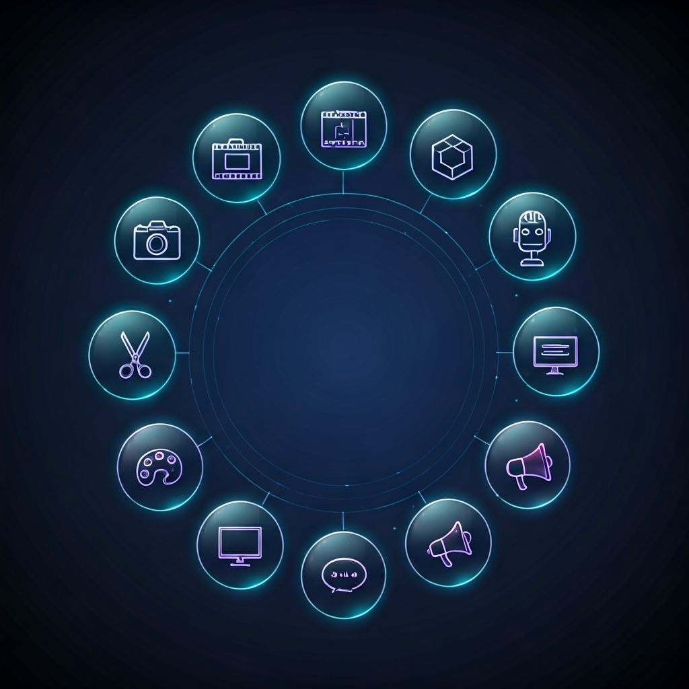
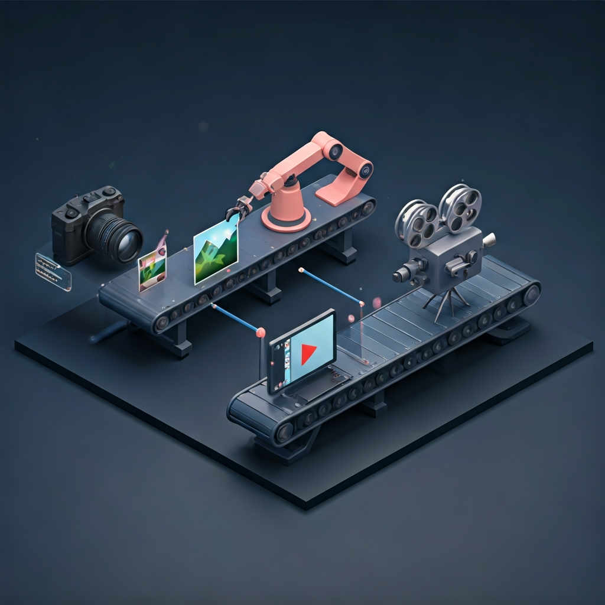

# KT AI MCP Ecosystem

<p align="center">
  
</p>

<p align="center">
  <a href="https://github.com/kevinten-ai"></a>
  <a href="https://modelcontextprotocol.io/"></a>
  
  
</p>

<p align="center">
  <strong>11 个 MCP 服务器，覆盖 AI 多媒体生产全流程。</strong><br>
  从文字创意到成品发布，一站式 AI 内容工厂。
</p>

<p align="center">
  <a href="#quick-start">Quick Start</a> ·
  <a href="#server-matrix">Server Matrix</a> ·
  <a href="#pipeline">Pipeline</a> ·
  <a href="#cost-guide">Cost Guide</a>
</p>

---

## Server Matrix

### 生成类（Generation）

| MCP Server | Tools | 能力 | 成本 | Repo |
|---|---|---|---|---|
| [**mcp-image-gen**](https://github.com/kevinten-ai/mcp-image-gen) | 3 | 文生图 + 编辑 + 超分 | 免费~$0.06/张 | [](https://github.com/kevinten-ai/mcp-image-gen) |
| [**mcp-video-gen**](https://github.com/kevinten-ai/mcp-video-gen) | 7 | 文/图生视频 + TTS + 音乐 + STT | 免费~$0.75/秒 | [](https://github.com/kevinten-ai/mcp-video-gen) |
| [**mcp-3d-gen**](https://github.com/kevinten-ai/mcp-3d-gen) | 3 | 文/图生3D模型 | 按量付费 | [](https://github.com/kevinten-ai/mcp-3d-gen) |
| [**mcp-avatar**](https://github.com/kevinten-ai/mcp-avatar) | 3 | 数字人/说话头像视频 | 按量付费 | [](https://github.com/kevinten-ai/mcp-avatar) |
| [**mcp-voice-clone**](https://github.com/kevinten-ai/mcp-voice-clone) | 5 | 声音克隆 + 高级TTS + 音效 | 按量付费 | [](https://github.com/kevinten-ai/mcp-voice-clone) |

### 处理类（Processing）

| MCP Server | Tools | 能力 | 成本 | Repo |
|---|---|---|---|---|
| [**mcp-ffmpeg**](https://github.com/kevinten-ai/mcp-ffmpeg) | 20+ | 视频/音频编辑全套 | **免费** | [](https://github.com/kevinten-ai/mcp-ffmpeg) |
| [**mcp-media-toolkit**](https://github.com/kevinten-ai/mcp-media-toolkit) | 5 | 去背景 + 素材搜索 + 裁切 + 拼图 | **免费** | [](https://github.com/kevinten-ai/mcp-media-toolkit) |
| [**mcp-subtitle**](https://github.com/kevinten-ai/mcp-subtitle) | 4 | 字幕生成 + 翻译 + 双语 + ASS | GCP赠金 | [](https://github.com/kevinten-ai/mcp-subtitle) |

### 输出类（Output）

| MCP Server | Tools | 能力 | 成本 | Repo |
|---|---|---|---|---|
| [**mcp-presentation**](https://github.com/kevinten-ai/mcp-presentation) | 4 | PPT生成 + 模板 + PDF导出 | **免费** | [](https://github.com/kevinten-ai/mcp-presentation) |
| [**mcp-content-styles**](https://github.com/kevinten-ai/mcp-content-styles) | 4 | 平台内容风格转换 | **免费** | [](https://github.com/kevinten-ai/mcp-content-styles) |
| [**mcp-social-publisher**](https://github.com/kevinten-ai/mcp-social-publisher) | 3 | 多平台社交媒体发布 | **免费** | [](https://github.com/kevinten-ai/mcp-social-publisher) |

---

## Pipeline

<p align="center">
  
</p>

### 端到端内容生产流水线

```
                    ┌─────────────────────────────────────────────────────────┐
                    │                    AI 编排层 (Claude)                     │
                    └─────────────┬───────────────────────────┬───────────────┘
                                  │                           │
              ┌───────────────────▼──────────────┐  ┌────────▼────────────┐
              │         生成 Generation          │  │   输出 Output       │
              │                                  │  │                     │
              │  mcp-image-gen ──► 图片           │  │  mcp-presentation   │
              │       │                          │  │       │             │
              │       ├── edit_image (编辑)       │  │       └── PPT/PDF   │
              │       └── upscale_image (超分)    │  │                     │
              │                                  │  │  mcp-content-styles │
              │  mcp-video-gen ──► 视频           │  │       │             │
              │       │                          │  │       └── 平台风格   │
              │       ├── generate_video (t2v)   │  │                     │
              │       ├── image_url (i2v)        │  │  mcp-social-pub.    │
              │       ├── generate_speech (TTS)  │  │       │             │
              │       ├── generate_music (BGM)   │  │       └── 发布到    │
              │       └── transcribe_audio (STT) │  │           各平台    │
              │                                  │  └─────────────────────┘
              │  mcp-3d-gen ──► 3D模型            │
              │  mcp-avatar ──► 数字人视频        │
              │  mcp-voice-clone ──► 克隆语音     │
              └──────────────┬───────────────────┘
                             │
              ┌──────────────▼───────────────────┐
              │         处理 Processing          │
              │                                  │
              │  mcp-ffmpeg ──► 合成/裁切/转码    │
              │  mcp-media-toolkit ──► 去背景/拼图│
              │  mcp-subtitle ──► 字幕/翻译       │
              └──────────────────────────────────┘
```

### 典型工作流示例

#### 1. 产品宣传视频

```
Claude: "制作一个手机产品宣传视频"

Step 1: mcp-image-gen → generate_image (产品渲染图 x5)
Step 2: mcp-media-toolkit → remove_background (去背景)
Step 3: mcp-image-gen → upscale_image (4x超分)
Step 4: mcp-video-gen → generate_video + image_url (图生视频)
Step 5: mcp-voice-clone → speak (品牌专属配音)
Step 6: mcp-video-gen → generate_music (背景音乐)
Step 7: mcp-subtitle → transcribe_to_srt + translate_srt (双语字幕)
Step 8: mcp-ffmpeg → concatenate + add_subtitles (合成)
Step 9: mcp-social-publisher → publish (发布到各平台)
```

#### 2. AI 数字人教学视频

```
Step 1: mcp-image-gen → generate_image (讲师形象)
Step 2: mcp-avatar → generate_talking_head (数字人视频)
Step 3: mcp-subtitle → transcribe_to_srt (自动字幕)
Step 4: mcp-ffmpeg → add_subtitles (烧字幕)
```

#### 3. 多语言内容本地化

```
Step 1: mcp-video-gen → transcribe_audio (提取原始字幕)
Step 2: mcp-subtitle → translate_srt (翻译为目标语言)
Step 3: mcp-subtitle → create_bilingual_srt (双语字幕)
Step 4: mcp-voice-clone → speak (目标语言配音)
Step 5: mcp-ffmpeg → add_subtitles (烧字幕到视频)
```

#### 4. 社交媒体内容矩阵

```
Step 1: mcp-image-gen → generate_image (核心视觉)
Step 2: mcp-content-styles → convert_content (各平台风格化)
Step 3: mcp-media-toolkit → resize_image (各平台尺寸适配)
Step 4: mcp-social-publisher → preview_content (预览)
Step 5: mcp-social-publisher → publish (批量发布)
```

---

## Provider Matrix

### 图片生成 Providers

| Provider | MCP | 模型 | 成本 | 质量 |
|---|---|---|---|---|
| Google Gemini | mcp-image-gen | gemini-2.0-flash | **免费** | Good |
| Google Imagen 4 | mcp-image-gen | imagen-4.0-generate-001 | $0.02/张 | High |
| Google Imagen 4 Ultra | mcp-image-gen | imagen-4.0-ultra-generate-001 | $0.06/张 | Highest |

### 视频生成 Providers

| Provider | MCP | 模型 | 成本 | 质量 |
|---|---|---|---|---|
| CogVideoX (智谱) | mcp-video-gen | cogvideox-flash | **免费** | Good |
| DashScope/Wan (阿里) | mcp-video-gen | wan2.6-t2v | 50秒免费 | High |
| Kling AI (可灵) | mcp-video-gen | kling-v2-master | 66积分/天 | High |
| MiniMax (海螺) | mcp-video-gen | Hailuo 2.3 | ~¥0.7/条 | Highest |
| Google Veo 3.1 | mcp-video-gen | veo-3.1-fast-generate-001 | $0.10/秒 | High (1080p) |

### 音频 Providers

| Provider | MCP | 能力 | 成本 |
|---|---|---|---|
| MiniMax TTS | mcp-video-gen | 中文语音 | ~¥0.01/次 |
| Google Lyria | mcp-video-gen | 纯器乐生成 | $0.06/33秒 |
| Fish Audio | mcp-voice-clone | 声音克隆(中文最佳) | ~¥0.01/字 |
| ElevenLabs | mcp-voice-clone | 声音克隆(英文最佳) + 音效 | $0.30/1K字符 |

### 数字人 Providers

| Provider | MCP | 能力 | 成本 |
|---|---|---|---|
| Hedra | mcp-avatar | 照片说话 | 按量付费 |
| D-ID | mcp-avatar | 数字人视频 | 按量付费 |

### 3D 生成 Providers

| Provider | MCP | 能力 | 成本 |
|---|---|---|---|
| Tripo3D | mcp-3d-gen | 文/图生3D | 按量付费 |

---

## Quick Start

### 最小安装（免费开始）

只需 2 个 MCP 即可开始：

```bash
# 1. 免费图片生成
claude mcp add -s user mcp-image \
  --env GEMINI_API_KEY=your_key \
  -- uv --directory /path/to/mcp-image-gen run image-gen

# 2. 免费视频生成
claude mcp add -s user mcp-video-gen \
  --env COGVIDEO_API_KEY=your_key \
  -- uv --directory /path/to/mcp-video-gen run video-gen
```

### 完整安装

<details>
<summary><b>全部 11 个 MCP 的安装命令</b></summary>

```bash
# ── 生成类 ──
# 图片 (AI Studio 免费)
claude mcp add -s user mcp-image \
  --env GEMINI_API_KEY=your_key \
  -- uv --directory /path/to/mcp-image-gen run image-gen

# 视频 (CogVideoX 免费 + Veo GCP)
claude mcp add -s user mcp-video-gen \
  --env COGVIDEO_API_KEY=your_key \
  --env GCP_PROJECT_ID=your-project \
  --env GEMINI_API_KEY=your_gcp_key \
  -- uv --directory /path/to/mcp-video-gen run --extra gcp video-gen

# 3D 模型
claude mcp add -s user mcp-3d-gen \
  --env TRIPO_API_KEY=your_key \
  -- uv --directory /path/to/mcp-3d-gen run model-gen

# 数字人
claude mcp add -s user mcp-avatar \
  --env HEDRA_API_KEY=your_key \
  -- uv --directory /path/to/mcp-avatar run avatar-gen

# 声音克隆
claude mcp add -s user mcp-voice-clone \
  --env FISH_AUDIO_API_KEY=your_key \
  -- uv --directory /path/to/mcp-voice-clone run voice-clone

# ── 处理类 ──
# FFmpeg 视频编辑
claude mcp add -s user ffmpeg-tools \
  -- uv --directory /path/to/mcp-ffmpeg run ffmpeg-tools

# 图片处理 (全免费)
claude mcp add -s user mcp-media-toolkit \
  --env PEXELS_API_KEY=your_key \
  -- uv --directory /path/to/mcp-media-toolkit run media-toolkit

# 字幕
claude mcp add -s user mcp-subtitle \
  --env GEMINI_API_KEY=your_gcp_key \
  -- uv --directory /path/to/mcp-subtitle run subtitle-gen

# ── 输出类 ──
# PPT 生成 (全免费)
claude mcp add -s user mcp-presentation \
  -- uv --directory /path/to/mcp-presentation run presentation-gen

# 内容风格
claude mcp add -s user mcp-content-styles \
  -- uv --directory /path/to/mcp-content-styles run mcp-content-styles

# 社交发布
claude mcp add -s user mcp-social-publisher \
  --env X_BEARER_TOKEN=your_token \
  -- uv --directory /path/to/mcp-social-publisher run social-publisher
```

</details>

---

## Cost Guide

### 免费层（$0）

| MCP | 免费能力 |
|---|---|
| mcp-image-gen | Gemini Flash 无限生图 |
| mcp-video-gen | CogVideoX 无限生视频 |
| mcp-ffmpeg | 全部工具免费 |
| mcp-media-toolkit | 全部工具免费（背景移除、裁切等） |
| mcp-presentation | 全部工具免费 |
| mcp-content-styles | 全部工具免费 |
| mcp-social-publisher | 预览功能免费 |

### GCP 赠金层（几百美元赠金可用数月）

| 能力 | 单价 | 赠金可用量 |
|---|---|---|
| Imagen 4 生图 | $0.02/张 | ~15,000 张 |
| Veo 3.1 Fast 视频 | $0.10/秒 | ~3,000 秒 |
| Lyria 音乐 | $0.06/33秒 | ~5,000 首 |
| STT 转录 | $0.016/分钟 | ~18,750 分钟 |
| 字幕翻译 | $20/1M字符 | ~15M 字符 |

### 付费 API 层

| Provider | 用途 | 最低消费 |
|---|---|---|
| MiniMax | 高质量中文TTS/视频/音乐 | ¥10 起充 |
| Fish Audio | 中文声音克隆 | 按量付费 |
| ElevenLabs | 英文声音克隆 + 音效 | $5/月起 |
| Hedra / D-ID | 数字人视频 | 按量付费 |

---

## Tech Stack

所有 MCP 服务器使用统一技术栈：

| 项目 | 技术 |
|---|---|
| 语言 | Python 3.10+ |
| 包管理 | uv |
| 构建 | hatchling |
| HTTP | httpx |
| MCP SDK | mcp >= 1.1.2 |
| 协议 | MCP stdio |

### 统一模式

- **Provider Registry** — 环境变量控制注册，动态工具 schema
- **Async Two-Step** — 生成类工具：submit → poll → download
- **Dual Auth** — GCP 服务：API Key 优先，ADC 兜底
- **Auto Download** — 生成结果自动存盘，时间戳命名
- **Graceful Degradation** — 可选依赖 `try/except ImportError`，不影响其他功能

---

## Contributing

每个 MCP 服务器是独立仓库，欢迎分别提 PR。

添加新 MCP 服务器时，请遵循以下约定：
1. 仓库名格式：`mcp-{功能名}`
2. 入口点格式：`{功能名}:main`
3. 包含 README.md + README_CN.md + CLAUDE.md
4. 使用 hatchling 构建系统
5. 更新本仓库的 Server Matrix

## License

所有 MCP 服务器均为 MIT 协议。
