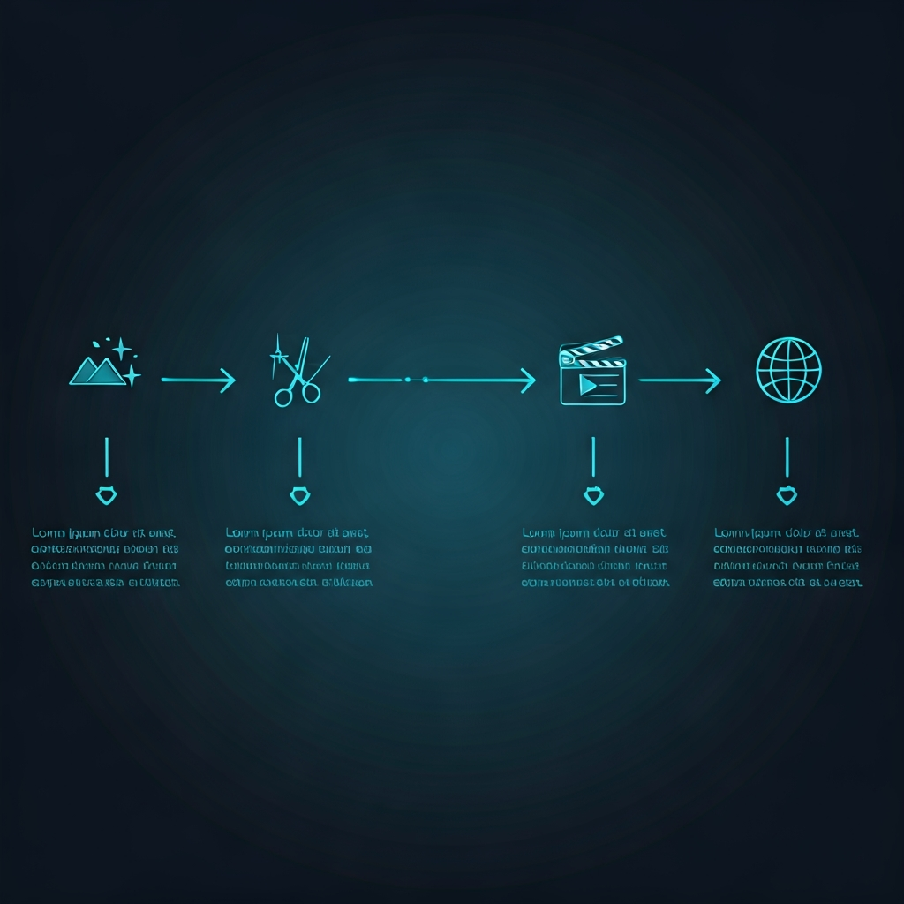

# MCP Workflow Templates

<p align="center">
  
</p>

预定义的工作流模板，展示如何组合多个 MCP 完成复杂任务。每个工作流都经过实际验证，可以直接告诉 AI 助手执行。

---

## 工作流总览

| # | 工作流 | 涉及 MCP | 复杂度 | 成本 |
|---|---|---|---|---|
| 1 | [短视频制作](#1-短视频制作流水线) | image + video + ffmpeg + subtitle + social | 高 | 免费~$5 |
| 2 | [多语言配音翻译](#2-多语言配音翻译) | subtitle + voice-clone + ffmpeg | 中 | $1~3 |
| 3 | [AI 讲师课程](#3-ai-讲师课程制作) | image + avatar + presentation + subtitle + ffmpeg | 高 | $3~10 |
| 4 | [社交媒体内容矩阵](#4-社交媒体内容矩阵) | image + media-toolkit + content-styles + social | 低 | 免费 |
| 5 | [产品 3D 展示](#5-产品-3d-展示视频) | image + 3d-gen + video + ffmpeg | 中 | $2~5 |
| 6 | [播客/有声书制作](#6-播客有声书制作) | voice-clone + video + ffmpeg | 低 | $1~3 |
| 7 | [品牌视觉套件](#7-品牌视觉套件生成) | image + media-toolkit + presentation | 低 | 免费~$1 |
| 8 | [电商产品图](#8-电商产品图批量制作) | image + media-toolkit | 低 | $0.5~2 |

---

## 1. 短视频制作流水线

**场景**：从文字创意到发布一条短视频（抖音/小红书/B站）

<p align="center">
  
</p>

**涉及 MCP**：`mcp-image-gen` → `mcp-media-toolkit` → `mcp-video-gen` → `mcp-ffmpeg` → `mcp-subtitle` → `mcp-content-styles` → `mcp-social-publisher`

```yaml
name: short_video_pipeline
description: 从文字创意到短视频发布的完整流水线
cost: 免费(CogVideoX) 或 ~$5(Veo)

steps:
  # Phase 1: 素材生成
  - tool: mcp-image-gen.generate_image
    params: { prompt: "产品/场景描述", model: "imagen-4.0-generate-001" }
    output: base_images[]
    note: 生成 3-5 张不同角度的图片

  - tool: mcp-media-toolkit.remove_background
    params: { image_path: "${base_images[0]}" }
    output: clean_image
    optional: true  # 仅产品图需要去背景

  - tool: mcp-image-gen.upscale_image
    params: { image_path: "${clean_image}", upscale_factor: "x2" }
    output: hd_image

  # Phase 2: 视频生成
  - tool: mcp-video-gen.generate_video
    params: { prompt: "动态描述", image_url: "${hd_image}", provider: "veo" }
    output: task_id
    note: 图生视频，保持画面一致性

  - tool: mcp-video-gen.query_video_status
    params: { task_id: "${task_id}", provider: "veo" }
    output: video_path
    poll: { interval: 30s, max_attempts: 10 }

  # Phase 3: 音频制作
  - tool: mcp-video-gen.generate_speech
    params: { text: "旁白文本", provider: "minimax" }
    output: voiceover_path

  - tool: mcp-video-gen.generate_music
    params: { prompt: "轻快活泼的背景音乐", provider: "google-lyria" }
    output: bgm_path

  # Phase 4: 后期合成
  - tool: mcp-ffmpeg.concatenate_videos
    params: { video_paths: ["${video_path}"], audio_path: "${voiceover_path}" }
    output: assembled_video

  - tool: mcp-subtitle.transcribe_to_srt
    params: { audio_path: "${voiceover_path}" }
    output: srt_path

  - tool: mcp-ffmpeg.add_subtitles
    params: { video_path: "${assembled_video}", subtitle_path: "${srt_path}" }
    output: final_video

  # Phase 5: 发布
  - tool: mcp-content-styles.convert_content
    params: { content: "标题+描述", platform: "xiaohongshu" }
    output: formatted_copy

  - tool: mcp-social-publisher.publish
    params: { platform: "xiaohongshu", title: "${formatted_copy.title}", content: "${formatted_copy.content}", video_path: "${final_video}" }
```

**提示词参考**：
> "帮我制作一条手机新品发布的短视频：先生成 3 张产品渲染图，去背景后用 Veo 生成动态展示视频，加上旁白配音和背景音乐，烧上字幕，最后格式化为小红书风格发布。"

---

## 2. 多语言配音翻译

<p align="center">
  
</p>

**场景**：将中文视频翻译为英文/日文版本，保留原说话人声线

**涉及 MCP**：`mcp-subtitle` → `mcp-voice-clone` → `mcp-ffmpeg`

```yaml
name: multilang_dubbing
description: 视频多语言本地化（保留声线）
cost: ~$1-3（取决于时长）

steps:
  # Phase 1: 提取原始内容
  - tool: mcp-ffmpeg.extract_audio_from_video
    params: { video_path: "original.mp4", output_audio_path: "original_audio.mp3" }
    output: audio_path

  - tool: mcp-subtitle.transcribe_to_srt
    params: { audio_path: "${audio_path}", language_code: "cmn-CN" }
    output: cn_srt

  # Phase 2: 翻译
  - tool: mcp-subtitle.translate_srt
    params: { srt_path: "${cn_srt}", target_language: "en" }
    output: en_srt

  - tool: mcp-subtitle.create_bilingual_srt
    params: { srt_path: "${cn_srt}", target_language: "en" }
    output: bilingual_srt

  # Phase 3: 声音克隆配音
  - tool: mcp-voice-clone.clone_voice
    params: { audio_path: "${audio_path}", name: "original_speaker" }
    output: cloned_voice_id
    note: 用原音频克隆说话人声线

  - tool: mcp-voice-clone.speak
    params: { text: "英文翻译文本", voice_id: "${cloned_voice_id}", provider: "elevenlabs" }
    output: en_voiceover

  # Phase 4: 合成
  - tool: mcp-subtitle.srt_to_ass
    params: { srt_path: "${bilingual_srt}", font_size: 18 }
    output: styled_subtitles

  - tool: mcp-ffmpeg.add_subtitles
    params: { video_path: "original.mp4", subtitle_path: "${styled_subtitles}" }
    note: 替换音轨 + 添加双语字幕
```

**提示词参考**：
> "把这个中文教学视频翻译成英文版本：提取音频，转录字幕，翻译成英文，用原说话人的声线克隆英文配音，加上中英双语字幕。"

---

## 3. AI 讲师课程制作

<p align="center">
  
</p>

**场景**：从讲稿生成完整的教学视频（AI 数字人 + PPT + 字幕）

**涉及 MCP**：`mcp-image-gen` → `mcp-presentation` → `mcp-avatar` → `mcp-subtitle` → `mcp-ffmpeg`

```yaml
name: ai_teacher_course
description: AI 数字人教学视频制作
cost: ~$3-10（取决于课程长度）

steps:
  # Phase 1: 准备素材
  - tool: mcp-image-gen.generate_image
    params: { prompt: "专业亚洲女性讲师半身照，白色背景，微笑，穿深蓝色西装" }
    output: teacher_photo

  - tool: mcp-presentation.create_slides
    params:
      title: "Python 入门教程"
      template: "corporate"
      slides:
        - { title: "什么是 Python", content: "• 简单易学\n• 用途广泛\n• 社区活跃", layout: "title_and_content" }
        - { title: "Hello World", content: "print('Hello, World!')", layout: "title_and_content" }
        - { title: "变量与类型", content: "• 字符串\n• 数字\n• 列表", layout: "two_column" }
    output: pptx_path

  # Phase 2: 数字人录制
  - tool: mcp-avatar.generate_talking_head
    params:
      image_path: "${teacher_photo}"
      text: "大家好，欢迎来到 Python 入门教程。今天我们将学习 Python 的基础知识..."
      provider: "hedra"
    output: avatar_task_id

  - tool: mcp-avatar.query_avatar_status
    params: { task_id: "${avatar_task_id}", provider: "hedra" }
    output: teacher_video
    poll: { interval: 30s }

  # Phase 3: 后期
  - tool: mcp-subtitle.transcribe_to_srt
    params: { audio_path: "${teacher_video}", language_code: "cmn-CN" }
    output: srt

  - tool: mcp-ffmpeg.add_subtitles
    params: { video_path: "${teacher_video}", subtitle_path: "${srt}" }
    output: final_lesson

  - tool: mcp-presentation.create_thumbnail
    params: { pptx_path: "${pptx_path}" }
    output: thumbnail
```

---

## 4. 社交媒体内容矩阵

<p align="center">
  
</p>

**场景**：一个核心创意，适配 4 个平台同时发布

**涉及 MCP**：`mcp-image-gen` → `mcp-media-toolkit` → `mcp-content-styles` → `mcp-social-publisher`

```yaml
name: content_matrix
description: 一次创作，多平台分发
cost: 免费（使用 Gemini 生图）

steps:
  # Phase 1: 核心素材
  - tool: mcp-image-gen.generate_image
    params: { prompt: "核心视觉创意描述" }
    output: hero_image

  # Phase 2: 多尺寸适配
  - tool: mcp-media-toolkit.resize_image
    params: { image_path: "${hero_image}", width: 1080, height: 1080, mode: "fill" }
    output: square_image  # 小红书 1:1

  - tool: mcp-media-toolkit.resize_image
    params: { image_path: "${hero_image}", width: 1080, height: 1920, mode: "fill" }
    output: portrait_image  # 抖音 9:16

  - tool: mcp-media-toolkit.resize_image
    params: { image_path: "${hero_image}", width: 1200, height: 675, mode: "fill" }
    output: landscape_image  # 微博/X 16:9

  # Phase 3: 文案风格化
  - tool: mcp-content-styles.convert_content
    params: { content: "核心文案", platform: "xiaohongshu" }
    output: xhs_copy

  - tool: mcp-content-styles.convert_content
    params: { content: "核心文案", platform: "weibo" }
    output: weibo_copy

  - tool: mcp-content-styles.convert_content
    params: { content: "核心文案", platform: "x" }
    output: x_copy

  # Phase 4: 预览 & 发布
  - tool: mcp-social-publisher.preview_content
    params: { platform: "xiaohongshu", title: "${xhs_copy.title}", content: "${xhs_copy.content}" }

  - tool: mcp-social-publisher.preview_content
    params: { platform: "weibo", title: "${weibo_copy.title}", content: "${weibo_copy.content}" }

  - tool: mcp-social-publisher.publish
    params: { platform: "x", title: "${x_copy.title}", content: "${x_copy.content}", image_paths: ["${landscape_image}"] }
```

**提示词参考**：
> "用这个创意生成一张图，然后适配小红书（正方形）、抖音（竖版）、微博（横版）三个尺寸，文案也按各平台风格调整，预览后发布。"

---

## 5. 产品 3D 展示视频

<p align="center">
  
</p>

**场景**：从产品描述生成 3D 模型 + 360度旋转展示视频

**涉及 MCP**：`mcp-image-gen` → `mcp-3d-gen` → `mcp-video-gen` → `mcp-ffmpeg`

```yaml
name: product_3d_showcase
description: 产品 3D 模型 + 展示视频
cost: ~$2-5

steps:
  - tool: mcp-image-gen.generate_image
    params: { prompt: "产品概念图，白色背景，高清产品摄影风格" }
    output: product_image

  - tool: mcp-image-gen.upscale_image
    params: { image_path: "${product_image}", upscale_factor: "x4" }
    output: hd_product_image

  - tool: mcp-3d-gen.generate_3d
    params: { prompt: "产品3D模型", image_url: "${hd_product_image}" }
    output: model_task_id

  - tool: mcp-3d-gen.query_3d_status
    params: { task_id: "${model_task_id}" }
    output: model_path
    poll: true

  - tool: mcp-video-gen.generate_video
    params: { prompt: "产品360度缓慢旋转展示，白色渐变背景，专业产品广告风格", image_url: "${hd_product_image}", provider: "veo" }
    output: video_task_id

  - tool: mcp-video-gen.query_video_status
    params: { task_id: "${video_task_id}", provider: "veo" }
    output: showcase_video

  - tool: mcp-video-gen.generate_music
    params: { prompt: "科技感背景音乐，简约优雅", provider: "google-lyria" }
    output: bgm

  - tool: mcp-ffmpeg.concatenate_videos
    params: { video_paths: ["${showcase_video}"], audio_path: "${bgm}" }
    output: final_showcase
```

---

## 6. 播客/有声书制作

<p align="center">
  
</p>

**场景**：将文字内容转换为专业品质的音频节目

**涉及 MCP**：`mcp-voice-clone` → `mcp-video-gen` → `mcp-ffmpeg`

```yaml
name: podcast_production
description: 文字 → 多角色有声内容
cost: ~$1-3

steps:
  # 单人播客
  - tool: mcp-voice-clone.speak
    params: { text: "播客脚本全文", voice_id: "charon", provider: "fish-audio", speed: 0.95 }
    output: main_audio

  # 多角色对话（有声书）
  - tool: mcp-voice-clone.speak
    params: { text: "角色A的台词", voice_id: "narrator_voice", provider: "fish-audio" }
    output: narrator_audio

  - tool: mcp-voice-clone.speak
    params: { text: "角色B的台词", voice_id: "character_voice", provider: "elevenlabs" }
    output: character_audio

  - tool: mcp-voice-clone.generate_sfx
    params: { prompt: "gentle rain and thunder ambient sound", duration: 30 }
    output: ambient_sfx

  # 合成
  - tool: mcp-ffmpeg.concatenate_videos  # 音频拼接也用这个
    params: { video_paths: ["${narrator_audio}", "${character_audio}"] }
    output: dialogue_audio

  # 生成封面
  - tool: mcp-image-gen.generate_image
    params: { prompt: "播客封面，${主题描述}，正方形，专业设计" }
    output: cover_image

  - tool: mcp-media-toolkit.resize_image
    params: { image_path: "${cover_image}", width: 3000, height: 3000, mode: "fill" }
    output: podcast_cover  # 播客平台要求 3000x3000
```

---

## 7. 品牌视觉套件生成

<p align="center">
  
</p>

**场景**：为新品牌快速生成一套视觉素材（Logo 概念、封面、名片、PPT 模板）

**涉及 MCP**：`mcp-image-gen` → `mcp-media-toolkit` → `mcp-presentation`

```yaml
name: brand_visual_kit
description: 品牌视觉素材全套生成
cost: 免费~$1

steps:
  # Logo 概念
  - tool: mcp-image-gen.generate_image
    params: { prompt: "极简品牌Logo设计，${品牌名}，${风格描述}，白色背景，矢量风格" }
    output: logo_concepts[]
    note: 生成 3-5 个方案

  # 去背景 + 多尺寸
  - tool: mcp-media-toolkit.remove_background
    params: { image_path: "${logo_concepts[0]}" }
    output: logo_transparent

  - tool: mcp-media-toolkit.resize_image
    params: { image_path: "${logo_transparent}", width: 512, height: 512, mode: "fit" }
    output: logo_avatar  # 社交媒体头像

  - tool: mcp-media-toolkit.resize_image
    params: { image_path: "${logo_transparent}", width: 1500, height: 500, mode: "fit" }
    output: logo_banner  # 社交媒体横幅

  # 品牌 PPT 模板
  - tool: mcp-presentation.create_slides
    params:
      title: "${品牌名} 介绍"
      template: "creative"
      slides:
        - { title: "关于我们", content: "品牌故事", layout: "title_and_content", image_path: "${logo_transparent}" }
        - { title: "产品服务", content: "核心业务", layout: "two_column" }
        - { title: "联系方式", content: "邮箱/电话", layout: "title_only" }
    output: brand_pptx

  # 封面拼图
  - tool: mcp-media-toolkit.create_collage
    params: { image_paths: ["${logo_concepts}"], columns: 3, spacing: 20 }
    output: logo_showcase
```

---

## 8. 电商产品图批量制作

<p align="center">
  
</p>

**场景**：为产品生成多角度、多场景的电商展示图

**涉及 MCP**：`mcp-image-gen` → `mcp-media-toolkit`

```yaml
name: ecommerce_product_images
description: 电商产品图批量生成
cost: ~$0.5-2

steps:
  # 主图（白底）
  - tool: mcp-image-gen.generate_image
    params: { prompt: "${产品描述}，白色背景，电商产品摄影风格，高清" }
    output: main_image

  # 场景图
  - tool: mcp-image-gen.generate_image
    params: { prompt: "${产品描述}，放在${使用场景}中，自然光，生活方式摄影" }
    output: lifestyle_image

  # 细节图
  - tool: mcp-image-gen.generate_image
    params: { prompt: "${产品描述}的细节特写，微距摄影，突出${材质/工艺}" }
    output: detail_image

  # 去背景（主图需要纯白背景）
  - tool: mcp-media-toolkit.remove_background
    params: { image_path: "${main_image}" }
    output: cutout_image

  # 超分放大
  - tool: mcp-image-gen.upscale_image
    params: { image_path: "${cutout_image}", upscale_factor: "x4" }
    output: hd_main

  # 平台尺寸适配
  - tool: mcp-media-toolkit.resize_image
    params: { image_path: "${hd_main}", width: 800, height: 800, mode: "fit" }
    output: taobao_main  # 淘宝主图 800x800

  - tool: mcp-media-toolkit.resize_image
    params: { image_path: "${hd_main}", width: 750, height: 1000, mode: "fit" }
    output: xhs_product  # 小红书产品图 3:4

  # 产品拼图
  - tool: mcp-media-toolkit.create_collage
    params: { image_paths: ["${main_image}", "${lifestyle_image}", "${detail_image}"], columns: 3 }
    output: product_overview
```

---

## 工作流组合原则

### 数据流方向

```
文字 → 图片 → 视频 ─┐
                    ├─→ 合成 → 输出
音频 → 字幕 ────────┘
```

### MCP 分层

| 层 | MCP | 角色 |
|---|---|---|
| **生成层** | image-gen, video-gen, 3d-gen, avatar, voice-clone | 创造原始素材 |
| **处理层** | ffmpeg, media-toolkit, subtitle | 加工和变换 |
| **输出层** | presentation, content-styles, social-publisher | 格式化和分发 |

### 成本优化策略

1. **免费优先**：先用 Gemini/CogVideoX 验证创意，满意后再用 Imagen 4/Veo 出高质量版本
2. **批量复用**：一次生成的图片可以同时用于视频、PPT、社交媒体
3. **GCP 赠金集中用**：Veo 视频和 Lyria 音乐是赠金消耗最快的，按需使用
4. **本地工具零成本**：ffmpeg、media-toolkit、presentation 全部本地运行，不限量
